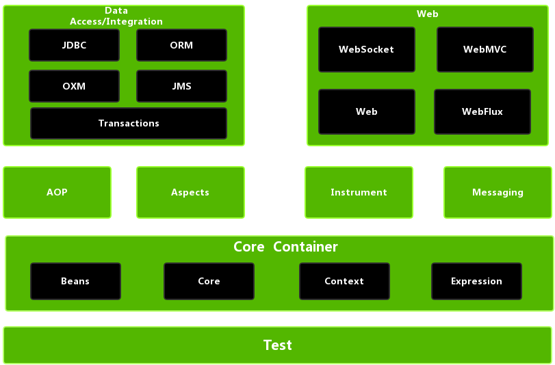
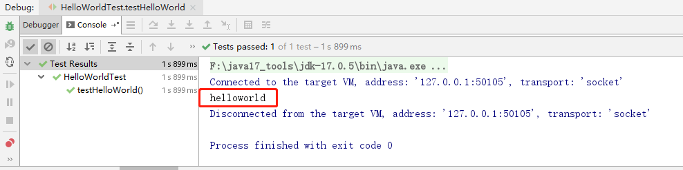

#   Spring6


## 1、概述

### 1.1、Spring是什么？

Spring 是一款主流的 Java EE 轻量级开源框架 ，Spring 由“Spring 之父”Rod Johnson 提出并创立，其目的是用于简化 Java 企业级应用的开发难度和开发周期。Spring的用途不仅限于服务器端的开发。从简单性、可测试性和松耦合的角度而言，任何Java应用都可以从Spring中受益。Spring 框架除了自己提供功能外，还提供整合其他技术和框架的能力。

Spring 自诞生以来备受青睐，一直被广大开发人员作为 Java 企业级应用程序开发的首选。时至今日，Spring 俨然成为了 Java EE 代名词，成为了构建 Java EE 应用的事实标准。

自 2004 年 4 月，Spring 1.0 版本正式发布以来，Spring 已经步入到了第 6 个大版本，也就是 Spring 6。本课程采用Spring当前最新发布的正式版本**6.0.2**。


### 1.2、Spring 的狭义和广义

在不同的语境中，Spring 所代表的含义是不同的。下面我们就分别从“广义”和“狭义”两个角度，对 Spring 进行介绍。

**广义的 Spring：Spring 技术栈**

广义上的 Spring 泛指以 Spring Framework 为核心的 Spring 技术栈。

经过十多年的发展，Spring 已经不再是一个单纯的应用框架，而是逐渐发展成为一个由多个不同子项目（模块）组成的成熟技术，例如 Spring Framework、Spring MVC、SpringBoot、Spring Cloud、Spring Data、Spring Security 等，其中 Spring Framework 是其他子项目的基础。

这些子项目涵盖了从企业级应用开发到云计算等各方面的内容，能够帮助开发人员解决软件发展过程中不断产生的各种实际问题，给开发人员带来了更好的开发体验。

**狭义的 Spring：Spring Framework**

狭义的 Spring 特指 Spring Framework，通常我们将它称为 Spring 框架。

Spring 框架是一个分层的、面向切面的 Java 应用程序的一站式轻量级解决方案，它是 Spring 技术栈的核心和基础，是为了解决企业级应用开发的复杂性而创建的。

Spring 有两个最核心模块： IoC 和 AOP。

**IoC**：Inverse of Control 的简写，译为“控制反转”，指把创建对象过程交给 Spring 进行管理。

**AOP**：Aspect Oriented Programming 的简写，译为“面向切面编程”。AOP 用来封装多个类的公共行为，将那些与业务无关，却为业务模块所共同调用的逻辑封装起来，减少系统的重复代码，降低模块间的耦合度。另外，AOP 还解决一些系统层面上的问题，比如日志、事务、权限等。


### 1.3、Spring Framework特点

- 非侵入式：使用 Spring Framework 开发应用程序时，Spring 对应用程序本身的结构影响非常小。对领域模型可以做到零污染；对功能性组件也只需要使用几个简单的注解进行标记，完全不会破坏原有结构，反而能将组件结构进一步简化。这就使得基于 Spring Framework 开发应用程序时结构清晰、简洁优雅。

- 控制反转：IoC——Inversion of Control，翻转资源获取方向。把自己创建资源、向环境索取资源变成环境将资源准备好，我们享受资源注入。

- 面向切面编程：AOP——Aspect Oriented Programming，在不修改源代码的基础上增强代码功能。

- 容器：Spring IoC 是一个容器，因为它包含并且管理组件对象的生命周期。组件享受到了容器化的管理，替程序员屏蔽了组件创建过程中的大量细节，极大的降低了使用门槛，大幅度提高了开发效率。

- 组件化：Spring 实现了使用简单的组件配置组合成一个复杂的应用。在 Spring 中可以使用 XML 和 Java 注解组合这些对象。这使得我们可以基于一个个功能明确、边界清晰的组件有条不紊的搭建超大型复杂应用系统。

- 一站式：在 IoC 和 AOP 的基础上可以整合各种企业应用的开源框架和优秀的第三方类库。而且 Spring 旗下的项目已经覆盖了广泛领域，很多方面的功能性需求可以在 Spring Framework 的基础上全部使用 Spring 来实现。

  

### 1.4、Spring模块组成

官网地址：https://spring.io/




上图中包含了 Spring 框架的所有模块，这些模块可以满足一切企业级应用开发的需求，在开发过程中可以根据需求有选择性地使用所需要的模块。下面分别对这些模块的作用进行简单介绍。

**①Spring Core（核心容器）**

spring core提供了IOC,DI,Bean配置装载创建的核心实现。核心概念： Beans、BeanFactory、BeanDefinitions、ApplicationContext。

- spring-core ：IOC和DI的基本实现

- spring-beans：BeanFactory和Bean的装配管理(BeanFactory)
- spring-context：Spring context上下文，即IOC容器(AppliactionContext)
- spring-expression：spring表达式语言

**②Spring AOP**

- spring-aop：面向切面编程的应用模块，整合ASM，CGLib，JDK Proxy
- spring-aspects：集成AspectJ，AOP应用框架
- spring-instrument：动态Class Loading模块

**③Spring Data Access**

- spring-jdbc：spring对JDBC的封装，用于简化jdbc操作
- spring-orm：java对象与数据库数据的映射框架
- spring-oxm：对象与xml文件的映射框架
- spring-jms： Spring对Java Message Service(java消息服务)的封装，用于服务之间相互通信
- spring-tx：spring jdbc事务管理

**④Spring Web**

- spring-web：最基础的web支持，建立于spring-context之上，通过servlet或listener来初始化IOC容器
- spring-webmvc：实现web mvc
- spring-websocket：与前端的全双工通信协议
- spring-webflux：Spring 5.0提供的，用于取代传统java servlet，非阻塞式Reactive Web框架，异步，非阻塞，事件驱动的服务

**⑤Spring Message**

- Spring-messaging：spring 4.0提供的，为Spring集成一些基础的报文传送服务

**⑥Spring test**

- spring-test：集成测试支持，主要是对junit的封装

  

### 1.5、Spring6特点

#### 1.5.1、版本要求

**（1）Spring6要求JDK最低版本是JDK17**


#### 1.5.2、本课程软件版本

（1）IDEA开发工具：2022.1.2

（2）JDK：Java17**（Spring6要求JDK最低版本是Java17）**

（3）Spring：6.0.2


## 2、入门

### 2.1、环境要求

- JDK：Java17+**（Spring6要求JDK最低版本是Java17）**

- Maven：3.6+

- Spring：6.0.2

  

### 2.2、构建模块

**（1）构建父模块spring6**

在idea中，依次单击 File -> New -> Project -> New Project


点击“Create”


删除src目录

**（2）构建子模块spring6-first**


点击 Create 完成


### 2.3、程序开发

#### 2.3.1、引入依赖

https://spring.io/projects/spring-framework#learn

**添加依赖：**

```xml
<dependencies>
    <!--spring context依赖-->
    <!--当你引入Spring Context依赖之后，表示将Spring的基础依赖引入了-->
    <dependency>
        <groupId>org.springframework</groupId>
        <artifactId>spring-context</artifactId>
        <version>6.0.2</version>
    </dependency>

    <!--junit5测试-->
    <dependency>
        <groupId>org.junit.jupiter</groupId>
        <artifactId>junit-jupiter-api</artifactId>
        <version>5.3.1</version>
    </dependency>
</dependencies>
```

**查看依赖：**


#### 2.3.2、创建java类

```java
package com.atguigu.spring6.bean;

public class HelloWorld {
    
    public void sayHello(){
        System.out.println("helloworld");
    }
}
```

#### 2.3.3、创建配置文件

在resources目录创建一个 Spring 配置文件 beans.xml（配置文件名称可随意命名，如：springs.xm）


```xml
<?xml version="1.0" encoding="UTF-8"?>
<beans xmlns="http://www.springframework.org/schema/beans"
       xmlns:xsi="http://www.w3.org/2001/XMLSchema-instance"
       xsi:schemaLocation="http://www.springframework.org/schema/beans http://www.springframework.org/schema/beans/spring-beans.xsd">

    <!--
    配置HelloWorld所对应的bean，即将HelloWorld的对象交给Spring的IOC容器管理
    通过bean标签配置IOC容器所管理的bean
    属性：
        id：设置bean的唯一标识
        class：设置bean所对应类型的全类名
	-->
    <bean id="helloWorld" class="com.atguigu.spring6.bean.HelloWorld"></bean>
    
</beans>
```

#### 2.3.4、创建测试类测试

```java
package com.atguigu.spring6.bean;

import org.junit.jupiter.api.Test;
import org.springframework.context.ApplicationContext;
import org.springframework.context.support.ClassPathXmlApplicationContext;

public class HelloWorldTest {

    @Test
    public void testHelloWorld(){
        ApplicationContext ac = new ClassPathXmlApplicationContext("beans.xml");
        HelloWorld helloworld = (HelloWorld) ac.getBean("helloWorld");
        helloworld.sayHello();
    }
}
```

#### 2.3.5、运行测试程序




### 2.4、程序分析

**1. 底层是怎么创建对象的，是通过反射机制调用无参数构造方法吗？**

修改HelloWorld类：

```java
package com.atguigu.spring6.bean;

public class HelloWorld {

    public HelloWorld() {
        System.out.println("无参数构造方法执行");
    }

    public void sayHello(){
        System.out.println("helloworld");
    }
}
```

执行结果：


**测试得知：创建对象时确实调用了无参数构造方法。**


**2. Spring是如何创建对象的呢？原理是什么？**

```java
// dom4j解析beans.xml文件，从中获取class属性值，类的全类名
 // 通过反射机制调用无参数构造方法创建对象
 Class clazz = Class.forName("com.atguigu.spring6.bean.HelloWorld");
 //Object obj = clazz.newInstance();
 Object object = clazz.getDeclaredConstructor().newInstance();
```


**3. 把创建好的对象存储到一个什么样的数据结构当中了呢？**

bean对象最终存储在spring容器中，在spring源码底层就是一个map集合，存储bean的map在**DefaultListableBeanFactory**类中：

```java
private final Map<String, BeanDefinition> beanDefinitionMap = new ConcurrentHashMap<>(256);
```

Spring容器加载到Bean类时 , 会把这个类的描述信息, 以包名加类名的方式存到beanDefinitionMap 中,
Map<String,BeanDefinition> , 其中 String是Key , 默认是类名首字母小写 , BeanDefinition , 存的是类的定义(描述信息) , 我们通常叫BeanDefinition接口为 : bean的定义对象。

### 2.5、启用Log4j2日志框架

#### 2.5.1、Log4j2日志概述

在项目开发中，日志十分的重要，不管是记录运行情况还是定位线上问题，都离不开对日志的分析。日志记录了系统行为的时间、地点、状态等相关信息，能够帮助我们了解并监控系统状态，在发生错误或者接近某种危险状态时能够及时提醒我们处理，同时在系统产生问题时，能够帮助我们快速的定位、诊断并解决问题。

**Apache Log4j2**是一个开源的日志记录组件，使用非常的广泛。在工程中以易用方便代替了 System.out 等打印语句，它是JAVA下最流行的日志输入工具。 

**Log4j2主要由几个重要的组件构成：**

**（1）日志信息的优先级**，日志信息的优先级从高到低有**TRACE < DEBUG < INFO < WARN < ERROR < FATAL**
                TRACE：追踪，是最低的日志级别，相当于追踪程序的执行
                DEBUG：调试，一般在开发中，都将其设置为最低的日志级别
                INFO：信息，输出重要的信息，使用较多
                WARN：警告，输出警告的信息
                ERROR：错误，输出错误信息
                FATAL：严重错误

这些级别分别用来指定这条日志信息的重要程度；级别高的会自动屏蔽级别低的日志，也就是说，设置了WARN的日志，则INFO、DEBUG的日志级别的日志不会显示

**（2）日志信息的输出目的地**，日志信息的输出目的地指定了日志将打印到**控制台**还是**文件中**；

**（3）日志信息的输出格式**，而输出格式则控制了日志信息的显示内容。


#### 2.5.2、引入Log4j2依赖

```xml
<!--log4j2的依赖-->
<dependency>
    <groupId>org.apache.logging.log4j</groupId>
    <artifactId>log4j-core</artifactId>
    <version>2.19.0</version>
</dependency>
<dependency>
    <groupId>org.apache.logging.log4j</groupId>
    <artifactId>log4j-slf4j2-impl</artifactId>
    <version>2.19.0</version>
</dependency>
```


#### 2.5.3、加入日志配置文件

在类的根路径下提供log4j2.xml配置文件（文件名固定为：log4j2.xml，文件必须放到类根路径下。）

```xml
<?xml version="1.0" encoding="UTF-8"?>
<configuration>
    <loggers>
        <!--
            level指定日志级别，从低到高的优先级：
                TRACE < DEBUG < INFO < WARN < ERROR < FATAL
                trace：追踪，是最低的日志级别，相当于追踪程序的执行
                debug：调试，一般在开发中，都将其设置为最低的日志级别
                info：信息，输出重要的信息，使用较多
                warn：警告，输出警告的信息
                error：错误，输出错误信息
                fatal：严重错误
        -->
        <root level="DEBUG">
            <appender-ref ref="spring6log"/>
            <appender-ref ref="RollingFile"/>
            <appender-ref ref="log"/>
        </root>
    </loggers>

    <appenders>
        <!--输出日志信息到控制台-->
        <console name="spring6log" target="SYSTEM_OUT">
            <!--控制日志输出的格式-->
            <PatternLayout pattern="%d{yyyy-MM-dd HH:mm:ss SSS} [%t] %-3level %logger{1024} - %msg%n"/>
        </console>

        <!--文件会打印出所有信息，这个log每次运行程序会自动清空，由append属性决定，适合临时测试用-->
        <File name="log" fileName="d:/spring6_log/test.log" append="false">
            <PatternLayout pattern="%d{HH:mm:ss.SSS} %-5level %class{36} %L %M - %msg%xEx%n"/>
        </File>

        <!-- 这个会打印出所有的信息，
            每次大小超过size，
            则这size大小的日志会自动存入按年份-月份建立的文件夹下面并进行压缩，
            作为存档-->
        <RollingFile name="RollingFile" fileName="d:/spring6_log/app.log"
                     filePattern="log/$${date:yyyy-MM}/app-%d{MM-dd-yyyy}-%i.log.gz">
            <PatternLayout pattern="%d{yyyy-MM-dd 'at' HH:mm:ss z} %-5level %class{36} %L %M - %msg%xEx%n"/>
            <SizeBasedTriggeringPolicy size="50MB"/>
            <!-- DefaultRolloverStrategy属性如不设置，
            则默认为最多同一文件夹下7个文件，这里设置了20 -->
            <DefaultRolloverStrategy max="20"/>
        </RollingFile>
    </appenders>
</configuration>
```


#### 2.5.4、测试

运行原测试程序


运行原测试程序，多了spring打印日志


#### 2.5.5、使用日志

```java
public class HelloWorldTest {

    private Logger logger = LoggerFactory.getLogger(HelloWorldTest.class);

    @Test
    public void testHelloWorld(){
        ApplicationContext ac = new ClassPathXmlApplicationContext("beans.xml");
        HelloWorld helloworld = (HelloWorld) ac.getBean("helloWorld");
        helloworld.sayHello();
        logger.info("执行成功");
    }
}
```

控制台：


## 3、容器：IoC

IoC 是 Inversion of Control 的简写，译为“控制反转”，它不是一门技术，而是一种设计思想，是一个重要的面向对象编程法则，能够指导我们如何设计出松耦合、更优良的程序。

Spring 通过 IoC 容器来管理所有 Java 对象的实例化和初始化，控制对象与对象之间的依赖关系。我们将由 IoC 容器管理的 Java 对象称为 Spring Bean，它与使用关键字 new 创建的 Java 对象没有任何区别。

IoC 容器是 Spring 框架中最重要的核心组件之一，它贯穿了 Spring 从诞生到成长的整个过程。

### 3.1、IoC容器

#### 3.1.1、控制反转（IoC）

- 控制反转是一种思想。
- 控制反转是为了降低程序耦合度，提高程序扩展力。
- 控制反转，反转的是什么？

- - 将对象的创建权利交出去，交给第三方容器负责。
  - 将对象和对象之间关系的维护权交出去，交给第三方容器负责。

- 控制反转这种思想如何实现呢？

- - DI（Dependency Injection）：依赖注入

#### 3.1.2、依赖注入

DI（Dependency Injection）：依赖注入，依赖注入实现了控制反转的思想。

**依赖注入：**

- **指Spring创建对象的过程中，将对象依赖属性通过配置进行注入**

依赖注入常见的实现方式包括两种：

- 第一种：set注入
- 第二种：构造注入

所以结论是：IOC 就是一种控制反转的思想， 而 DI 是对IoC的一种具体实现。

**Bean管理说的是：Bean对象的创建，以及Bean对象中属性的赋值（或者叫做Bean对象之间关系的维护）。**

#### 3.1.3、IoC容器在Spring的实现

Spring 的 IoC 容器就是 IoC思想的一个落地的产品实现。IoC容器中管理的组件也叫做 bean。在创建 bean 之前，首先需要创建IoC 容器。Spring 提供了IoC 容器的两种实现方式：

**①BeanFactory**

这是 IoC 容器的基本实现，是 Spring 内部使用的接口。面向 Spring 本身，不提供给开发人员使用。

**②ApplicationContext**

BeanFactory 的子接口，提供了更多高级特性。面向 Spring 的使用者，几乎所有场合都使用 ApplicationContext 而不是底层的 BeanFactory。

**③ApplicationContext的主要实现类**


| 类型名                          | 简介                                                         |
| ------------------------------- | ------------------------------------------------------------ |
| ClassPathXmlApplicationContext  | 通过读取类路径下的 XML 格式的配置文件创建 IOC 容器对象       |
| FileSystemXmlApplicationContext | 通过文件系统路径读取 XML 格式的配置文件创建 IOC 容器对象     |
| ConfigurableApplicationContext  | ApplicationContext 的子接口，包含一些扩展方法 refresh() 和 close() ，让 ApplicationContext 具有启动、关闭和刷新上下文的能力。 |
| WebApplicationContext           | 专门为 Web 应用准备，基于 Web 环境创建 IOC 容器对象，并将对象引入存入 ServletContext 域中。 |


### 3.2、基于XML管理Bean

#### 3.2.1、搭建子模块spring6-ioc-xml

**①搭建模块**

搭建方式如：spring-first

**②引入配置文件**

引入spring-first模块配置文件：beans.xml、log4j2.xml

**③添加依赖**

```xml
<dependencies>
    <!--spring context依赖-->
    <!--当你引入Spring Context依赖之后，表示将Spring的基础依赖引入了-->
    <dependency>
        <groupId>org.springframework</groupId>
        <artifactId>spring-context</artifactId>
        <version>6.0.3</version>
    </dependency>

    <!--junit5测试-->
    <dependency>
        <groupId>org.junit.jupiter</groupId>
        <artifactId>junit-jupiter-api</artifactId>
        <version>5.3.1</version>
    </dependency>

    <!--log4j2的依赖-->
    <dependency>
        <groupId>org.apache.logging.log4j</groupId>
        <artifactId>log4j-core</artifactId>
        <version>2.19.0</version>
    </dependency>
    <dependency>
        <groupId>org.apache.logging.log4j</groupId>
        <artifactId>log4j-slf4j2-impl</artifactId>
        <version>2.19.0</version>
    </dependency>
</dependencies>
```

**④引入java类**

引入spring-first模块java及test目录下实体类

```java
package com.atguigu.spring6.bean;

public class HelloWorld {

    public HelloWorld() {
        System.out.println("无参数构造方法执行");
    }

    public void sayHello(){
        System.out.println("helloworld");
    }
}

```

```java
package com.atguigu.spring6.bean;

import org.junit.jupiter.api.Test;
import org.slf4j.Logger;
import org.slf4j.LoggerFactory;
import org.springframework.context.ApplicationContext;
import org.springframework.context.support.ClassPathXmlApplicationContext;

public class HelloWorldTest {

    private Logger logger = LoggerFactory.getLogger(HelloWorldTest.class);

    @Test
    public void testHelloWorld(){
        
    }
}
```


#### 3.2.2、实验一：获取bean

##### ①方式一：根据id获取

由于 id 属性指定了 bean 的唯一标识，所以根据 bean 标签的 id 属性可以精确获取到一个组件对象。上个实验中我们使用的就是这种方式。

##### ②方式二：根据类型获取

```java
@Test
public void testHelloWorld1(){
	ApplicationContext ac = new ClassPathXmlApplicationContext("beans.xml");
    HelloWorld bean = ac.getBean(HelloWorld.class);
    bean.sayHello();
}
```

##### ③方式三：根据id和类型

```java
@Test
public void testHelloWorld2(){
	ApplicationContext ac = new ClassPathXmlApplicationContext("beans.xml");
    HelloWorld bean = ac.getBean("helloworld", HelloWorld.class);
    bean.sayHello();
}
```

##### ④注意的地方

当根据类型获取bean时，要求IOC容器中指定类型的bean有且只能有一个

当IOC容器中一共配置了两个：

```xml
<bean id="helloworldOne" class="com.atguigu.spring6.bean.HelloWorld"></bean>
<bean id="helloworldTwo" class="com.atguigu.spring6.bean.HelloWorld"></bean>
```

根据类型获取时会抛出异常：

> org.springframework.beans.factory.NoUniqueBeanDefinitionException: No qualifying bean of type 'com.atguigu.spring6.bean.HelloWorld' available: expected single matching bean but found 2: helloworldOne,helloworldTwo

##### ⑤扩展知识

如果组件类实现了接口，根据接口类型可以获取 bean 吗？

> 可以，前提是bean唯一

如果一个接口有多个实现类，这些实现类都配置了 bean，根据接口类型可以获取 bean 吗？

> 不行，因为bean不唯一

**结论**

根据类型来获取bean时，在满足bean唯一性的前提下，其实只是看：『对象 **instanceof** 指定的类型』的返回结果，只要返回的是true就可以认定为和类型匹配，能够获取到。

java中，instanceof运算符用于判断前面的对象是否是后面的类，或其子类、实现类的实例。如果是返回true，否则返回false。也就是说：用instanceof关键字做判断时， instanceof 操作符的左右操作必须有继承或实现关系